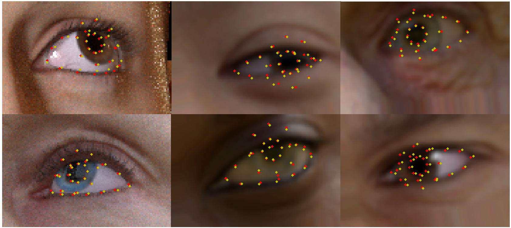
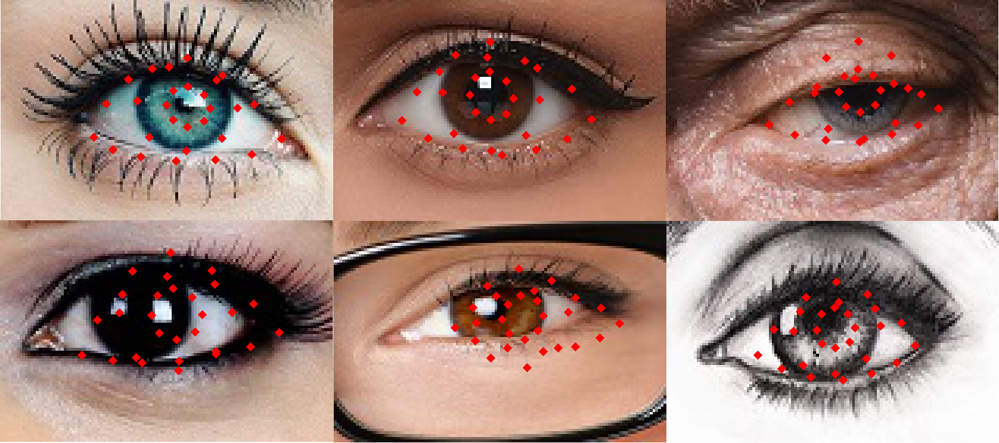

# CNN-based Eye Landmark Estimation

[](LICENSE)

## Description

Code for the CNN-based Eye Landmark Estimation project under the supervision of Roberto Valenti at [SightCorp](http://sightcorp.com).


<p align="justify">
  Robust facial landmark estimation in-the-wild is a challenging task due to many variations in image conditions, pose and occlusion. Traditional research in landmark estimation uses feature-based methods and the extension of such approaches towards robust performance against large variations is challenging and computationally expensive. In this work we focus on estimating eye landmarks and present a convolutional neural network model for 2D and 3D landmark estimation. Furthermore, we define custom a evaluation metric and objective function which are more suitable for the task of landmark estimation. We show that through data augmentation, the network is able to generalize from synthetic images to real-world images and handle a variety of image, pose and gaze conditions, achieving a 93% 2D landmark estimation accuracy in test data. The quality of the 3D eye shapes reconstructed from estimated landmarks is acceptable despite the lack of depth information.
</p>


Synthetic Data             |  Real Data
:-------------------------:|:-------------------------:
  |  

<p align="center"> 
  <i> Yellow: true labels - Red: estimated landmarks </i>
</p>


## Documents
- [Paper](documents/report.pdf)
- [Presentation](documents/presentation.pdf)

## Testing
```bash
python src/live_demo.py
```
## Dependencies

See [requirements.txt](./requirements.txt).

## Contributors

- [Dana Kianfar](https://github.com/danakianfar)
- [Jose Gallego](https://github.com/jgalle29)

## Copyright

Copyright © 2017 Dana Kianfar and Jose Gallego.

<p align="justify">
This project is distributed under the <a href="LICENSE">MIT license</a>. This was developed as part of the Project AI course coordinated by Maarten van Someren at the University of Amsterdam. Please follow the <a href="http://student.uva.nl/en/az/content/plagiarism-and-fraud/plagiarism-and-fraud.html">UvA regulations governing Fraud and Plagiarism</a> in case you are a student.
</p>
